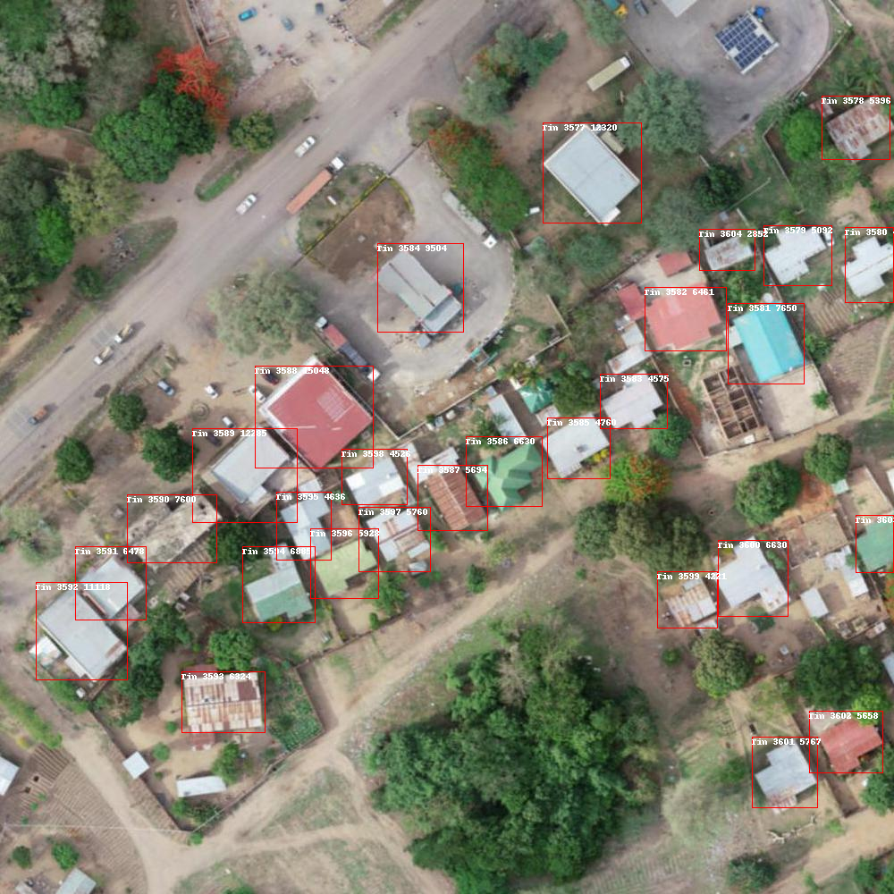
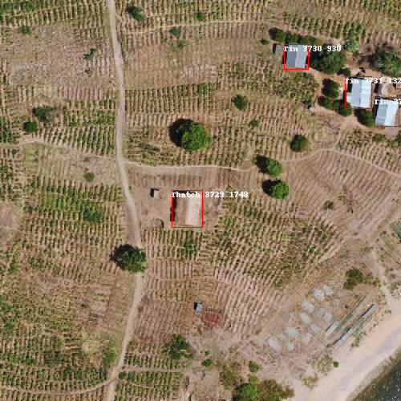

# Arm UNICEF Disaster Reliability

## Project Description:
This repo is a representation of my participation in a ML Competition on the Zindi platform.

### Situation: 
The aim of the project was to help identify thatch houses which may be overlooked by drones/satellites during flood disaster recovery efforts.

### Task:
Developed a computer vision object detection model to detect 3 types of roofed houses:
* Tin roofed houses
* Thatched houses (Main class of interest)
* Other type

### Dataset
Approximately 14GB uncompressed
* 4772 Train images 
* 2045 Test images

### Action:
Trained an object detection model

## Tools

## Important libraries and frameworks
* PyTorch and torchvision
* PyTorch Lightning to help with distributed training and multiples types of accelerators
* MLflow, Tensorboard for model tracking and monitoring
* HuggingFace Hub
* Albumentations for data augmentation
* Captum for model interpretability
* Argparse for preparing scripts
* Vertex AI AutoML in the beginning

## Models
* Faster RCNN with ResNet50 with FPN Backbone
* Faster RCNN with Mobilenet V3 with FPN Backbone
* YOLOv8
## Sample outputs
### 1

### 2 

